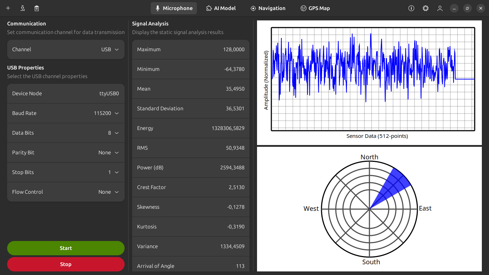
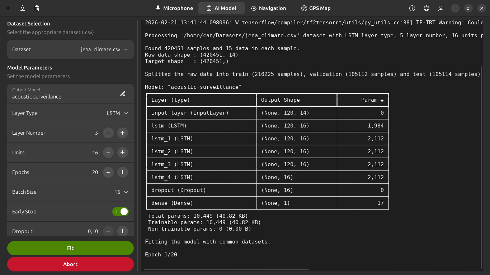
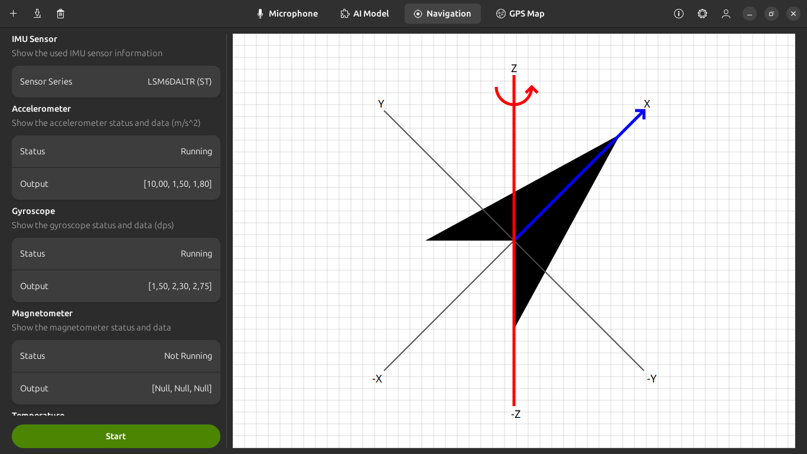
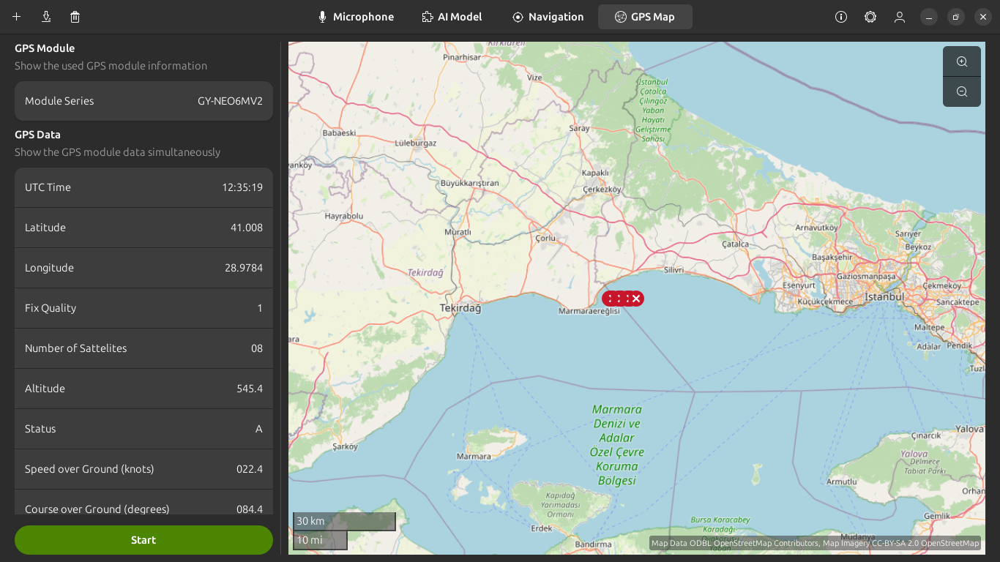

# Passive Acoustic Surveillance System

This project is being designed for TUBITAK 2209-A project. It's basically passive 
acoustic surveillance system primarily designed for drones and helicopers. It 
consists of three parts:

+ Custom DSP library
+ Embedded firmware driver
+ Ground station application

For this project, a custom DSP library was designed. So that in ground station, 
the all signal processing operations are done over this library. It's also
published at my GitHub as separate repo.

To get the repo, use this command:

```bash
$ git clone https://github.com/CanGulmez/Digital-Signal-Processing.git
```

Also I put the library and header file in the **./lib** directory.

At embedded side, the firmware was written for STM32H75x series microcontroller. 
There is no externel dependencies for the firmware building, flashing and running. 
The build system is Makefile-based. So that make sure that `make` command is avaliable.

Overall, there should be installed the STM32CubeH7 library installed with:

```bash
$ git clone --recurse-submodules https://github.com/STMicroelectronics/STM32CubeH7.git
```

After installed the library, extracted the CMSIS, FreeRTOS and HAL modules and then
put these under `./driver`.

The firmware building is done over two `make` commands. First step is to make the
static library including the CMSIS, FreeRTOS and HAL components. It's done often for
one time. After that, the main program is being compiled as linking with the library.
It must be done after the any changes were being made.

```bash
$ make lib					# build the static library
$ make bin					# build the firmware program
```

Lastly, the firmware is flashed into the microcontroller in a way. Makefile currently
don't dictate any way. But mostly it is done over `openocd` tool:

```bash
$ openocd -f interface/stlink.cfg -f target/stm32f4x.cfg -c "program firmware.elf verify reset exit"
```

Above command is a short-hand way to open the `openocd` session and flash it quickly.

If the debugger is wanted, these `openocd` and `arm-none-eabi-gdb` must be used
separately.

At ground station side, it is done on the Linux machine so that the all codebase is
writting with POSIX standards. To build and then run the ground station, use this 
command:

```bash
$ make station
```

The ground station is integrated with many libraries that you have to install by
hand. To install the all required libraries, use this command:

```bash
$ sudo apt install check \
	libgsl-dev \
	libadwaita-1-dev \
	libgtk-4-dev \
	libshumate-dev \
	libsqlite3-dev \
	pkg-config
```

To run the project in isolated environment, you need to build a Docker image with
this command:

```bash
$ docker build -t sonar .
```

This command will create a **sonar** image using the Dockerfile instructions. This
project is based GTK-4 so that you need to specify that which window server (X11
or Wayland) you will use from the Docker image. I'm gonna use the X11 server for my
image. Firstly, enable it for Docker with this command:

```bash
$ xhost +SI:localuser:root
```

After that, create and run the docker container with this command:

```bash
$ docker run -it --rm -e DISPLAY=$DISPLAY -e GDK_BACKEND=x11 -v /tmp/.X11-unix:/tmp/.X11-unix sonar
```

After entered into the **sonar** container, again run the ground station.

The ground station has four sub-modules:

+ Microphone
+ AI Model
+ Navigation
+ GPS Map

In `Micophone` sub-module, there are three sections. At left side, there is the
channel configurations. The embedded firmware can be read from many channels. 
At center, there is the signal analysises. As I said, it is done over my custom DSP
library. Also there are cartesian and polar plots to visualize the sensor data.



In `AI Model` sub-module, there is a deep learning model written in Python 3 with
**Tensorflow** library. At UI, there is a model parameter selection panel. This 
model is being run as a **child** process. It's made by **fork()/exec()** routines 
as general. Because, model fitting is computationally heavy.



In `Navigation` sub-module, the IMU (Interial Measurement Unit) sensor data is
being visualized.



In `GPS Map` sub-module, there is also a shumate map that shows the GPS module 
outputs.

